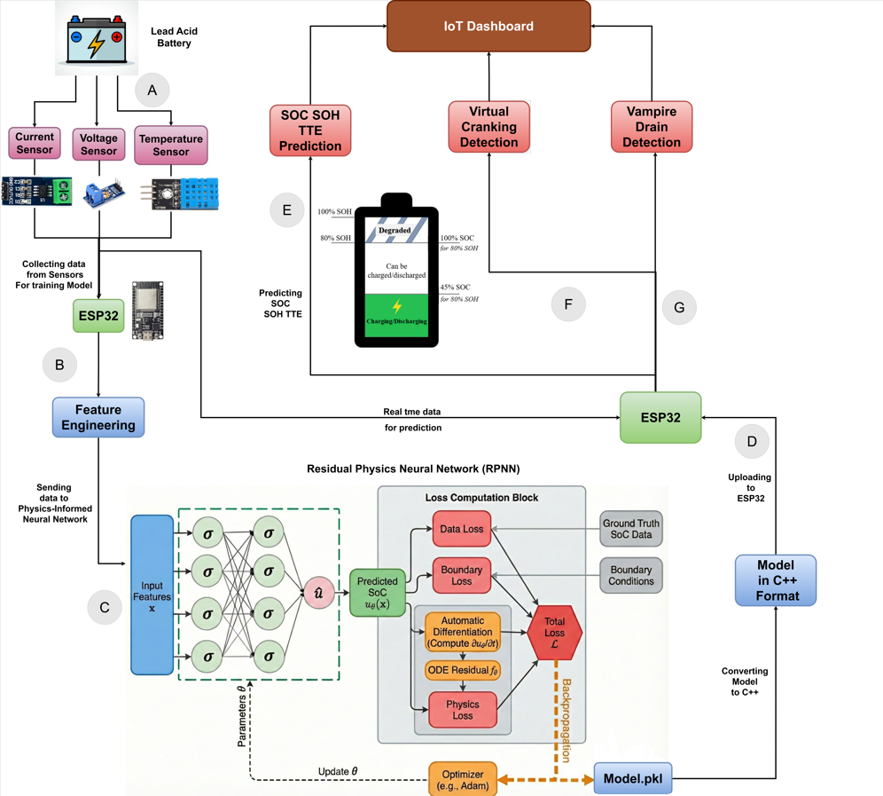
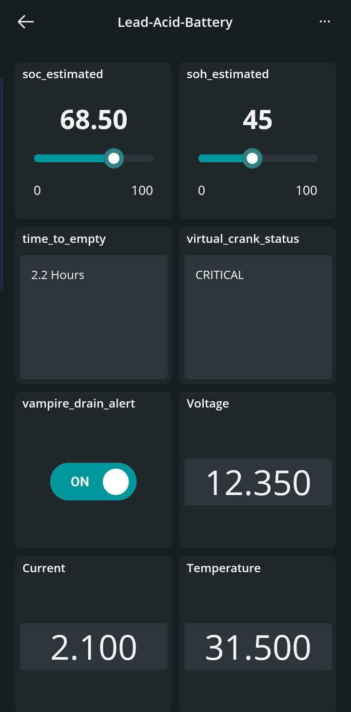

# TinyML Battery Health Monitor & Virtual Cranking Estimator

---

## Table of Contents
&nbsp;[Introduction](#introduction)   
&nbsp;[Why I built this](#why-i-built-this)   
&nbsp;[Key Features](#key-features)    
&nbsp;[System Architecture](#system-architecture)    
&nbsp;[Real-Time Dashboard](#real-time-dashboard)    
&nbsp;[Model Performance](#model-performance)    
&nbsp;[Build Instructions](#build-instructions)    

## Introduction
In this project, I built an IoT-based edge machine learning system to predict the **State of Charge (SOC)**, **State of Health (SOH)**, and **Time-To-Empty (TTE)** for standard 12V Lead-Acid batteries. *(Note: The research paper detailing this work has been accepted at the NE-IECCE 2026 conference and will be published in IEEE).*

Instead of relying on simple voltage readings (which are often misleading and don't reflect internal battery aging), I implemented a Coulomb Counting method to establish a highly accurate `True_SoC` baseline. I then collected a massive dataset using IoT sensors and trained various machine learning models—eventually leading to a novel **Residual-Physics Neural Network (RPNN)**—to predict battery health directly on an ESP32 microcontroller without needing cloud inference.

This repository contains the data processing notebooks, the baseline model benchmarks (Random Forest, XGBoost, GRU, etc.), and the physical logic for failure prediction.

## Why I built this?
Even the most advanced Electric Vehicles (EVs) rely on the trusty 12V lead-acid battery to run critical safety systems. The most common method for checking their health relies solely on voltage—but checking voltage alone is dangerously unreliable. A battery can show a "good" reading even while suffering from severe internal aging. By the time the voltage drops, it's often too late, and your car simply refuses to start.

Furthermore, most existing machine learning solutions for battery health focus entirely on Lithium-ion batteries, or they rely on computationally intensive algorithms that stream data to the cloud. If you're driving in an area with poor cell reception, a cloud-based system becomes useless. I wanted to build a predictive, offline system that runs entirely on edge hardware (like an ESP32) to warn you of a failure *before* you get stranded.

## Key Features
* **Custom TinyML Deployment Pipeline**: Instead of relying on automated 3rd-party platforms, I built a custom deployment pipeline from scratch. I converted the TensorFlow PINN model into a **Full INT8 Quantized TFLite** model (shrinking its footprint by 75%), extracted it into a raw C++ byte array using `xxd`, and deployed it to run natively on the ESP32 using `TensorFlowLite_ESP32`. This allows the complex physics-informed model to run entirely offline.
* **State of Charge (SOC) Prediction**: Predicts SOC to tell the user about the percentage left in their battery.
* **State of Health (SOH) Estimation**: Detects permanent battery degradation by comparing the currently measured capacity against the manufacturer's rated capacity, identifying whether a battery is truly failing or just temporarily discharged.
* **Virtual Cranking Detection**: By calculating internal resistance ($\Delta V / \Delta I$) on the fly, the code mathematically simulates a sudden 200A engine-start load. If the predicted voltage drops below the 7.5V ECU cutoff, it sends a pre-emptive warning.
* **Vampire Drain Alerting**: The system monitors quiescent current when the engine is off. If it detects abnormal current (like a light left on or a short circuit), it immediately alerts you to prevent an irreversible overnight discharge.
* **Dynamic Time-to-Empty (TTE)**: Calculates exactly how many hours and minutes of battery life you have left based on a moving average of the current load.
* **Deep Sleep Optimization**: To make sure the monitoring system doesn't *become* a parasitic drain itself, I designed it to wake up, run the ML inference, send the telemetry to the cloud, and go back to an ultra-low-power sleep state.

## System Architecture

Here is a high-level look at how the sensor data flows into the ESP32, gets processed by the TinyML engine, and alerts the user:

## Real-Time Dashboard

I connected the ESP32 directly to the Arduino IoT Cloud so I could monitor everything on the go. The resulting real-time dashboard lets you pull out your phone and instantly check your battery's SOC, SOH, and Time-to-Empty. It also pushes live alerts for Virtual Cranking and Vampire Drain directly to your screen.

*Note: The machine learning inference happens **100% offline** on the edge device itself. The internet connection is strictly used for pushing telemetry to this dashboard. By simply integrating a small screen (like an OLED display) with the ESP32, this entire system can run fully offline without any network dependency!*

## Model Performance

I collected a custom dataset (`iot.csv`) containing nearly 20,000 samples of Voltage, Current, and Temperature by continuously discharging a 12V 7Ah battery. I tested multiple algorithms to see which one performed best before deploying to the edge:

| Algorithm | R² Score | MAE | MSE |
| :--- | :---: | :---: | :---: |
| **RPNN (My Physics-Informed Model)** | **0.9970** | **0.6815** | **0.6408** |
| Gradient Boosting | 0.9846 | 2.5978 | 13.8933 |
| XGBoost | 0.9846 | 2.5696 | 13.8817 |
| Random Forest | 0.9845 | 2.5630 | 13.9292 |
| Linear Regression | 0.7357 | 11.9984| 238.0323 |

> *Note: The RPNN significantly outperformed the baselines because it actually embeds the fundamental physical equations of the battery directly into its loss function!*
